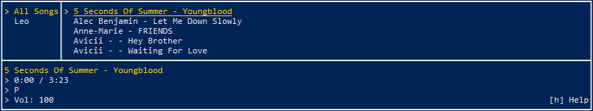

# C++ Terminal Music Player

A simple terminal-based music player written in C++ using **SFML** for audio playback and **FTXUI** for a lightweight text-based user interface.

## Features

- **Playlist support** – Load and play songs from custom playlists.
- **Browse & select** – Choose playlists and individual tracks via a clean TUI.
- **Controls** – Play, pause, skip, loop and shuffle tracks. Full volume controls.
